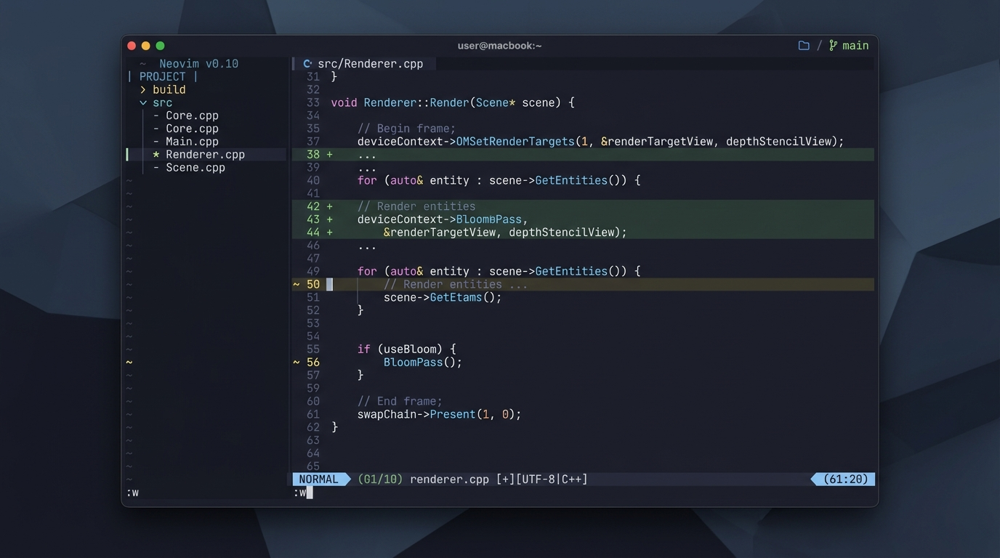
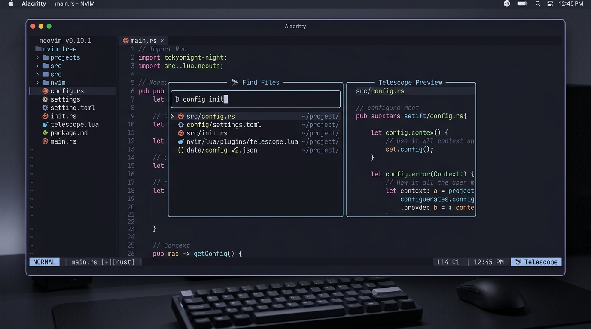

<div align="center">

# ⚡ Native Neovim 0.12+ Config

<p align="center">
  <b>A lightning-fast, zero-dependency, single-file IDE configuration built natively for Neovim 0.12+</b>
</p>

[](https://neovim.io/)
[](https://www.lua.org/)
[](https://github.com/folke/tokyonight.nvim)
[](https://neovim.io/doc/user/repeat.html#vim.pack)

---

### 📸 Preview



<br/>



</div>

---

## ✨ Features

- **🚀 Zero-Dependency Bootstrap:** Powered by Neovim's brand new built-in `vim.pack.add` API — no third-party package managers (Lazy/Packer/Plug) required.
- **📄 Single File Architecture:** Everything is cleanly organized inside a single, transparent [`init.lua`](file:///home/ajinkya/.config/nvim/init.lua).
- **📁 VS Code-style File Explorer:** [nvim-tree.lua](https://github.com/nvim-tree/nvim-tree.lua) sidebar for visual project browsing, file creation/renaming/deletion, and Git status indicators.
- **🌐 Full-Stack Ready:** Configured for TypeScript, JavaScript, React/TSX, Tailwind CSS, HTML/CSS, Python (Django/FastAPI), SQL, Docker, JSON/YAML, C/C++, and Lua.
- **🏷️ HTML/JSX Auto-Tagging:** [nvim-ts-autotag](https://github.com/windwp/nvim-ts-autotag) auto-closes and auto-renames HTML/JSX/TSX tags.
- **🎨 Inline Color Previews:** [nvim-colorizer.lua](https://github.com/NvChad/nvim-colorizer.lua) highlights Hex, RGB, HSL, and Tailwind CSS classes in real-time.
- **🔄 Surround Editing:** [mini.surround](https://github.com/echasnovski/mini.surround) for instant surrounding with quotes, brackets, or HTML tags (`sa`, `sd`, `sr`).
- **🎨 Modern Aesthetics:** [Tokyo Night (Moon)](https://github.com/folke/tokyonight.nvim) theme paired with [mini.icons](https://github.com/echasnovski/mini.icons) & [mini.statusline](https://github.com/echasnovski/mini.statusline) rendering mode icons (`󰋜 NORMAL`, `󰏫 INSERT`, `󰈈 VISUAL`, `󰞷 COMMAND`, ` TERMINAL`).
- **💡 Keymap Helper Popup:** [which-key.nvim](https://github.com/folke/which-key.nvim) interactive popup helper for discovering leader keybindings on the fly.
- **🌿 Git Integration:** [gitsigns.nvim](https://github.com/lewis6991/gitsigns.nvim) for gutter change indicators, hunk navigation (`]c`/`[c`), line blame popups, and hunk previews.
- **🔍 Fast Fuzzy Finding:** [Telescope](https://github.com/nvim-telescope/telescope.nvim) configured to find files, live grep text (including hidden files with safe binary/size filtering), search help, and switch buffers.
- **⚡ Native Treesitter & LSP:** Built-in Neovim 0.12 Treesitter syntax parsing + [Mason](https://github.com/williamboman/mason.nvim) LSP integration with custom diagnostic signs (`󰅚` Error, `󰀦` Warn, `󰋼` Info, `󰌵` Hint) and `--query-driver` support for C/C++ (`clangd`).
- **⌨️ Intelligent Autocompletion:** [nvim-cmp](https://github.com/hrsh7th/nvim-cmp) with LuaSnip snippet engine, LSP sources, path completion, buffer word completion, and auto-pairing (`nvim-autopairs`).

---

## 🏆 Why This Config? (Comparison & Strong Points)

How this configuration compares to popular Neovim starter frameworks (**Kickstart.nvim**, **LazyVim**, and **NvChad**):

| Feature / Capability | This Config | Kickstart.nvim | LazyVim | NvChad | Why It Matters |
| :--- | :---: | :---: | :---: | :---: | :--- |
| **Native Zero-Dependency Bootstrap** | ✅ **`vim.pack`** | ❌ (Lazy.nvim) | ❌ (Lazy.nvim) | ❌ (Lazy.nvim) | Powered 100% by Neovim 0.12+ built-in package management — zero third-party package managers needed. |
| **Crash-Proof Memory Guard** | ✅ **Built-in** | ❌ None | ❌ None | ❌ None | Prevents PC freezes and Linux OOM swap lockups by enforcing 100KB limits and binary blacklists on search previewers. |
| **100% `pcall` Exception Shield** | ✅ **Complete** | ⚠️ Partial | ⚠️ Partial | ⚠️ Partial | Every single plugin and module is guarded with fallback safety so Neovim will never crash on startup. |
| **Full-Stack Out of the Box** | ✅ **Complete** | ⚠️ Minimal | ⚠️ Extra plugins | ⚠️ Extra plugins | Pre-configured for React/TSX, TypeScript, Tailwind CSS, Python/Django, SQL, Docker, HTML/CSS, and Emmet. |
| **HTML/JSX Auto-Tag & Rename** | ✅ Built-in | ❌ None | ⚠️ Extra module | ❌ None | Automatically closes and renames matching tags dynamically in real time. |
| **Live CSS / Tailwind Color Badges** | ✅ Built-in | ❌ None | ⚠️ Extra module | ✅ Built-in | Instant inline color background badges for Hex, RGB, HSL, and Tailwind CSS utility classes. |
| **Surround Operations (`mini.surround`)** | ✅ Built-in | ❌ None | ⚠️ Optional | ❌ None | Rapid quote, bracket, and XML/HTML tag addition, deletion, and replacement (`sa`, `sd`, `sr`). |
| **Sensitive Buffer Undo-Protection** | ✅ Built-in | ❌ None | ❌ None | ❌ None | Automatically disables persistent undo and swap files for `.env`, `*.secret`, `*.pem`, `*.key`, and `id_rsa*`. |
| **Single-File Architecture** | ✅ **1 File** | ✅ 1 File | ❌ Multi-file | ❌ Multi-file | Complete clarity and transparency — zero nested module chains or obfuscated defaults. |
| **Reproducible Lockfile** | ✅ **`nvim-pack-lock.json`**| ❌ None | ⚠️ `lazy-lock.json` | ⚠️ `lazy-lock.json` | Pinned commit SHAs ensure identical, deterministic behavior on every machine. |

---

## 📋 Prerequisites & Requirements

### 📦 Quick Install by Operating System

<details open>
<summary><b>🐧 Arch Linux (pacman & yay)</b></summary>

```bash
# 1. Install core system tools, runtimes, and nerd fonts
sudo pacman -Syu --needed \
  git ripgrep fd base-devel unzip curl \
  wl-clipboard xclip nodejs npm python python-pip \
  ttf-jetbrains-mono-nerd

# 2. Install Neovim 0.12+ (if not yet in official stable repos)
yay -S neovim-nightly-bin
```
</details>

<details>
<summary><b>🐧 Ubuntu / Debian (apt)</b></summary>

```bash
# 1. Install core packages, runtimes, and tools
sudo apt update && sudo apt install -y \
  git ripgrep fd-find build-essential unzip curl \
  wl-clipboard xclip nodejs npm python3 python3-pip

# 2. Symlink fd for Telescope
sudo ln -sf $(which fdfind) /usr/local/bin/fd

# 3. Install Neovim 0.12+ (from official GitHub release / appimage / PPA)
curl -LO https://github.com/neovim/neovim/releases/download/nightly/nvim-linux-x86_64.tar.gz
sudo tar -C /usr/local -xzf nvim-linux-x86_64.tar.gz --strip-components=1
rm nvim-linux-x86_64.tar.gz
```
</details>

<details>
<summary><b>🍎 macOS (Homebrew)</b></summary>

```bash
brew install neovim --HEAD
brew install git ripgrep fd node npm python3 font-jetbrains-mono-nerd-font
```
</details>

<br/>

### 🔍 Detailed Dependency Breakdown

| Dependency | Minimum Version | Description |
| :--- | :--- | :--- |
| **Neovim** | `≥ 0.12.0` | **Strict requirement** for native `vim.pack` package management & `vim.lsp.config`. |
| **Git** | Any modern version | Required by `vim.pack` for auto-cloning and updating plugins. |
| **Ripgrep (`rg`)** | Any | High-performance text searching for Telescope (`<Space> s g`). |
| **fd** | Recommended | High-speed, `.gitignore`-aware file indexer for Telescope (`<Space> s f`). |
| **C/C++ Compiler (`gcc`/`clang`)** | Any | Required by Treesitter to automatically build syntax parsers locally. |
| **Node.js & npm** | `≥ 18.x` | Required by Mason to run web language servers (`ts_ls`, `tailwindcss`, `pyright`, `html`, `cssls`, `emmet`). |
| **Python & pip** | `≥ 3.10` | For Python language servers, formatters, and linters. |
| **Clipboard Tool** | `wl-clipboard` / `xclip` / `pbcopy` | Enables seamless system clipboard synchronization (`clipboard = 'unnamedplus'`). |
| **Nerd Font** | Recommended | Renders statusline mode icons, nvim-tree glyphs, and LSP diagnostic signs (`󰅚`, `󰀦`, `󰋼`, `󰌵`). |

---

## 🚀 Quick Start

1. **Backup your existing configuration (if any):**
   ```bash
   mv ~/.config/nvim ~/.config/nvim.bak
   ```

2. **Clone this repository into `~/.config/nvim`:**
   ```bash
   git clone https://github.com/AMSearth/Latest_Neovim_config.git ~/.config/nvim
   ```

3. **Launch Neovim:**
   ```bash
   nvim
   ```
   *Neovim will automatically clone and bootstrap all 23 plugins, compile Treesitter parsers, and apply the Tokyo Night Moon theme on first boot with zero manual configuration!*

---

## ⌨️ Keybindings

The `<Leader>` key is set to **`<Space>`**.

### 🪟 Navigation & General

| Keybinding | Action | Mode |
| :--- | :--- | :--- |
| `<Space> e` | **Toggle File Explorer** (`nvim-tree` sidebar) | Normal |
| `<C-h>` / `<C-j>` / `<C-k>` / `<C-l>` | Move focus to Left / Down / Up / Right window split | Normal |
| `<Esc>` | Clear search highlights | Normal |
| `<Space> q` | Open Diagnostic Quickfix List | Normal |
| `<Esc><Esc>` | Exit Terminal Mode to Normal Mode | Terminal |
| `J` / `K` | Move selected lines Down / Up | Visual |
| `<` / `>` | Indent Left / Right (retains visual selection) | Visual |

### 📁 File Explorer (`nvim-tree`)

| Keybinding | Action | Context |
| :--- | :--- | :--- |
| `<Space> e` | **Toggle / Focus** File Explorer sidebar | Global |
| `<CR>` or `o` | Open file / Expand or collapse folder | Inside Tree |
| `a` | Create new file (append `/` to create directory) | Inside Tree |
| `d` | Delete file or directory | Inside Tree |
| `r` | Rename file or directory | Inside Tree |
| `c` / `p` | Copy / Paste file | Inside Tree |
| `x` | Cut file | Inside Tree |
| `H` / `I` | Toggle hidden / Git-ignored files visibility | Inside Tree |
| `q` | Close File Explorer sidebar | Inside Tree |

### 🔄 Surround Operations (`mini.surround`)

| Keybinding | Action | Example |
| :--- | :--- | :--- |
| `sa` | **Add** surrounding character | `saiw"` surrounds word with `"` |
| `sd` | **Delete** surrounding character | `sd"` removes surrounding `"` |
| `sr` | **Replace** surrounding character | `sr"'` changes `"` to `'` |

### 🔍 Telescope (Fuzzy Search)

| Keybinding | Action | Mode |
| :--- | :--- | :--- |
| `<Space> s f` | Search Files (includes hidden files, ignores `.git`) | Normal |
| `<Space> s g` | Live Grep / Search Text across project | Normal |
| `<Space> s b` | Search lines in current Buffer | Normal |
| `<Space> s w` | Search word under cursor | Normal |
| `<Space> s h` | Search Help Tags | Normal |
| `<Space> s k` | Search Keymaps | Normal |
| `<Space> s d` | Search Workspace Diagnostics | Normal |
| `<Space> <Space>` | Switch between open buffers | Normal |

### 🤖 Autocompletion (Insert Mode)

| Keybinding | Action | Mode |
| :--- | :--- | :--- |
| `<C-y>` | **Accept & Confirm** autocompletion suggestion | Insert |
| `<C-n>` | Select **Next** suggestion item in popup menu | Insert |
| `<C-p>` | Select **Previous** suggestion item in popup menu | Insert |
| `<C-l>` | Jump **Forward** to next snippet placeholder | Insert / Snippet |
| `<C-h>` | Jump **Backward** to previous snippet placeholder | Insert / Snippet |
| `<C-b>` / `<C-f>` | Scroll documentation window Up / Down | Insert |
| `<C-Space>` | Trigger autocompletion menu manually | Insert |

### 🧠 LSP & Code Tools

| Keybinding | Action | Mode |
| :--- | :--- | :--- |
| `g d` | Go to Definition | Normal |
| `g D` | Go to Declaration | Normal |
| `g r` | Go to References | Normal |
| `g I` | Go to Implementation | Normal |
| `<Space> D` | Go to Type Definition | Normal |
| `K` | Display Hover Documentation | Normal |
| `[d` / `]d` | Jump to Previous / Next Diagnostic issue | Normal |
| `<Space> c d` | Show line Diagnostic popup window | Normal |
| `<Space> c f` | **Format current Buffer** (LSP / Prettier / Black) | Normal |
| `<Space> t h` | **Toggle Inlay Hints** (Variable & Parameter types) | Normal |
| `<Space> r n` | Rename Symbol | Normal |
| `<Space> c a` | Code Action (Select & Apply LSP quick-fix suggestions) | Normal |

### 🌿 Git Hunks (`gitsigns`)

| Keybinding | Action | Mode |
| :--- | :--- | :--- |
| `]c` / `[c` | Jump to Next / Previous Git Hunk | Normal |
| `<Space> h p` | Preview Git Hunk | Normal |
| `<Space> h b` | Toggle Line Blame | Normal |
| `<Space> h s` | Stage Git Hunk | Normal |
| `<Space> h r` | Reset Git Hunk | Normal |

---

## 📁 File Structure

```
~/.config/nvim/
├── init.lua              # Complete single-file Neovim configuration
├── nvim-pack-lock.json   # Lockfile specifying exact Git commit SHAs for vim.pack
├── assets/               # README preview screenshots
├── README.md             # Project documentation
└── .gitignore            # Git ignore rules
```

---

<div align="center">
  <sub>Built with ❤️ for Neovim 0.12+</sub>
</div>


